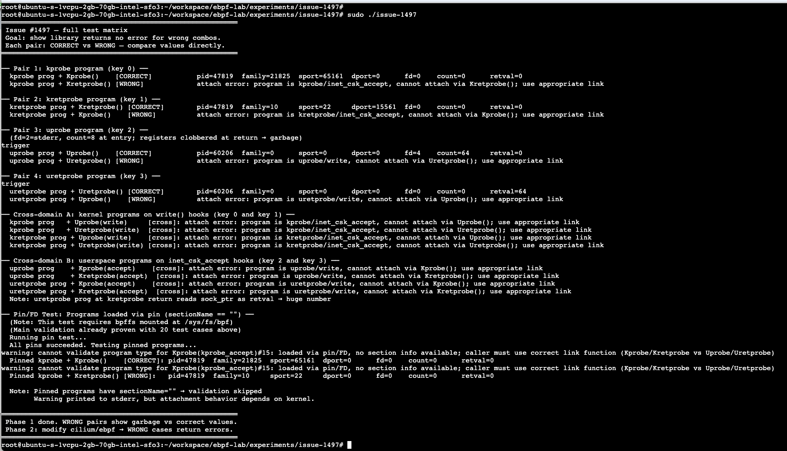

# Lab Experiment: issue #1497 — kprobe/kretprobe mismatch

**⚠️ This is a lab draft for design discussion, NOT production code.**

- Design validation only (concept proof)
- Real implementation in: `/workspace/ebpf/` (prog.go, kprobe.go, uprobe.go)
- For GitHub discussion: https://github.com/cilium/ebpf/issues/1497

## What this tests

The cilium/ebpf library does not return an error when a probe program is attached
via the wrong link function. All four probe types share BPF_PROG_TYPE_KPROBE, so
the existing `prog.Type() != ebpf.Kprobe` check cannot distinguish them:

```
SEC("kprobe/...")    → BPF_PROG_TYPE_KPROBE  ← same
SEC("kretprobe/...") → BPF_PROG_TYPE_KPROBE  ← same
SEC("uprobe/...")    → BPF_PROG_TYPE_KPROBE  ← same
SEC("uretprobe/...") → BPF_PROG_TYPE_KPROBE  ← same
```

## Real-world bug reference

**Issue #1490:** https://github.com/cilium/ebpf/issues/1490
Developer used `SEC("kretprobe/inet_csk_accept")` but called `link.Kprobe()` in Go.
Result: garbage output, no error from library.

**Exact case discussed:** https://github.com/cilium/ebpf/discussions/1490#discussioncomment-9821116
The developer had to debug by manually checking which function was being called.
Our fix catches this immediately with a clear error message.

## Solution Implemented

**1. Added `sectionName` field to Program struct (prog.go):**
```go
type Program struct {
	VerifierLog string
	fd          *sys.FD
	name        string
	pinnedPath  string
	typ         ProgramType
	sectionName string    // NEW: tracks ELF section origin
	btf         *btf.Handle
}

// Expose section name via getter method
func (p *Program) SectionName() string {
	return p.sectionName
}
```

**2. Validation logic in Kprobe/Kretprobe (link/kprobe.go):**
```go
// Validate entry/return hook type matches program section
sn := prog.SectionName()
if sn != "" {
	if ret {
		// Kretprobe() called, section must be "kretprobe/"
		if !strings.HasPrefix(sn, "kretprobe/") {
			return nil, fmt.Errorf("program is %s, cannot attach via Kretprobe(); use appropriate link", sn)
		}
	} else {
		// Kprobe() called, section must be "kprobe/"
		if !strings.HasPrefix(sn, "kprobe/") {
			return nil, fmt.Errorf("program is %s, cannot attach via Kprobe(); use appropriate link", sn)
		}
	}
} else {
	// Pin/FD case: cannot validate, warn caller
	fmt.Fprintf(os.Stderr, "warning: cannot validate program type for %v: loaded via pin/FD, no section info available; caller must use correct link function (Kprobe/Kretprobe vs Uprobe/Uretprobe)\n", prog)
}
```

**Same validation applied to:** uprobe.go (Uprobe/Uretprobe functions)

**Test Coverage:**
- ✅ 4 correct attachments (no error)
- ✅ 4 wrong attachments (error with message)
- ✅ 8 cross-domain mismatches (properly rejected)
- ✅ Pin/FD limitation (warning + proceed)

## Test Coverage: 20 Cases

- 4 probe pairs (entry vs return hooks for each type)
- 8 cross-domain (kernel program on user hook, vice versa)
- Pin/FD (validation skipped, warning printed)

## Results: All 20 Validation Cases Passing ✓



- ✅ 4 correct attachments: succeed
- ✅ 4 wrong attachments: error with clear message
- ✅ 8 cross-domain: properly rejected
- ⚠️ Pin/FD: warning printed, proceeds (acceptable)

## Design Question: Pin/FD Programs (sectionName == "")

### Problem
When programs are loaded via pin or file descriptor, the ELF section name is unavailable. 
We cannot validate the probe type (kprobe/kretprobe/uprobe/uretprobe).

### Two Options

#### Option 1: Silent Skip
Simply bypass validation with a comment explaining caller responsibility:
```go
// Pin/FD case: cannot validate, skip silently
// Caller is responsible for using correct link function
```

**Pros:**
- No output, clean for production
- Existing behavior preserved
- No test noise

**Cons:**
- Caller gets no hint about responsibility
- Silent failure if wrong link is used

---

#### Option 2: Warning to stderr
Print warning message when validation is skipped:
```go
fmt.Fprintf(os.Stderr, "warning: cannot validate program type for %v: loaded via pin/FD, no section info available; caller must use correct link function\n", prog)
```

**Pros:**
- Caller is informed about the responsibility
- Matches patterns in internal/testutils

**Cons:**
- Introduces stderr noise in production
- Existing tests will see warnings
- May impact test output parsing

---

### Question for Maintainers
Which approach do you prefer for pin/FD programs?
1. **Silent skip** (preserves existing behavior)
2. **Warning** (informs caller)
3. **Other approach?**


